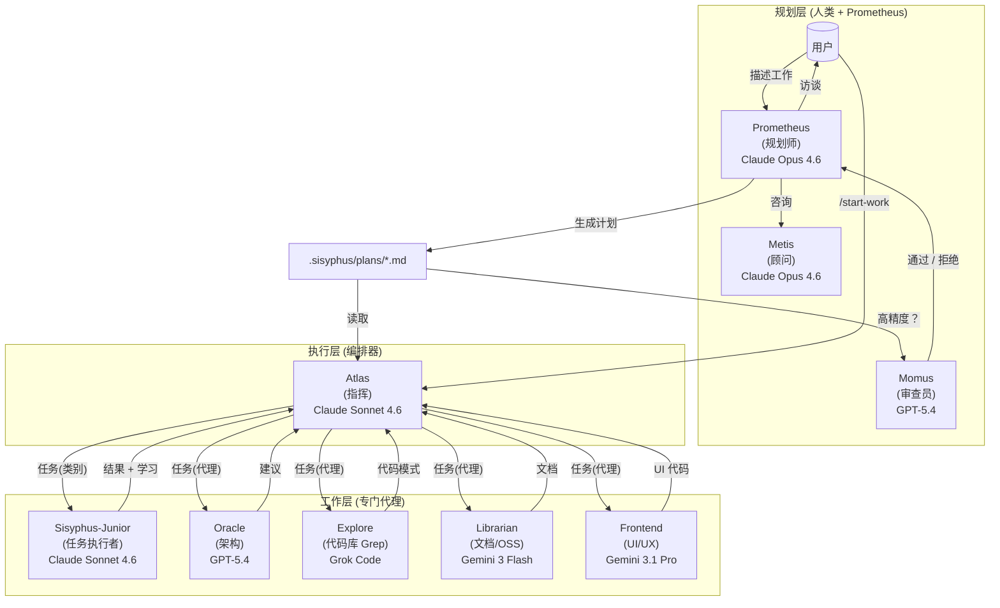
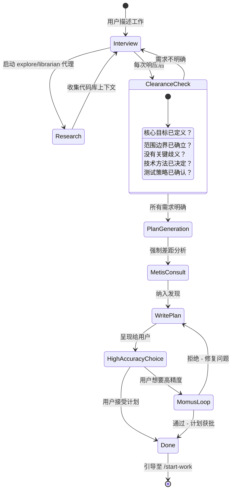
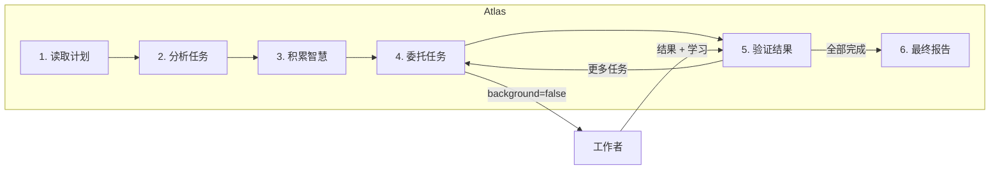

# 编排系统指南

Oh My OpenAgent 的编排系统通过**计划与执行分离**，将一个简单的 AI 代理转变为一个协调的开发团队。

---

## 太长不看 (TL;DR) - 何时使用什么

| 复杂性                | 方法                      | 何时使用                                                                                 |
| --------------------- | ------------------------- | ---------------------------------------------------------------------------------------- |
| **简单**              | 直接提示                  | 简单的任务，快速修复，单文件更改                                           |
| **复杂 + 懒惰**       | 输入 `ulw` 或 `ultrawork` | 解释上下文很繁琐的复杂任务。代理自己会弄清楚。                 |
| **复杂 + 精确**       | `@plan` → `/start-work`   | 需要真正编排的精确的、多步的工作。Prometheus 计划，Atlas 执行。 |

**决策流程：**

```
这是快速修复或简单任务吗？
  └─ 是 → 像平常一样直接提示
  └─ 否 → 解释完整上下文很繁琐吗？
              └─ 是 → 输入 "ulw" 让代理自己弄清楚
              └─ 否 → 你需要精确的、可验证的执行吗？
                         └─ 是 → 使用 @plan 进行 Prometheus 计划，然后 /start-work
                         └─ 否 → 直接使用 "ulw"
```

---

## 架构

编排系统使用三层架构，通过专业化和委托解决了上下文过载、认知漂移和验证差距。



---

## 规划：Prometheus + Metis + Momus

### Prometheus：你的战略顾问

Prometheus 不仅仅是一个规划师，它是一个聪明的面试官，帮助你想清楚你实际需要什么。它是**只读的** - 只能在 `.sisyphus/` 目录中创建或修改 markdown 文件。

**面试过程：**



**特定意图的策略：**

Prometheus 根据你在做的事情调整其面试风格：

| 意图                   | Prometheus 重点                | 示例问题                                                   |
| ---------------------- | ------------------------------ | ---------------------------------------------------------- |
| **重构**               | 安全性 - 行为保留              | "什么测试验证当前行为？" "回滚策略？"                      |
| **从头开始构建**       | 发现 - 模式优先                | "在代码库中找到了模式 X。遵循它还是偏离它？"               |
| **中型任务**           | 护栏 - 精确的边界              | "什么绝对不能包含？硬性约束？"                             |
| **架构**               | 战略性 - 长期影响              | "预期的寿命？规模要求？"                                   |

### Metis：差距分析器

在 Prometheus 编写计划之前，Metis 会发现 Prometheus 遗漏的内容：

- 用户请求中隐藏的意图
- 可能破坏实现的歧义
- AI 糟粕模式（过度工程、范围蔓延）
- 缺失的验收标准
- 未解决的边缘情况

**为什么 Metis 存在：**

计划作者（Prometheus）有“ADHD 工作记忆” - 它建立的联系从未写在纸上。Metis 强制将隐性知识外化。

### Momus：无情的审查员

对于高精度模式，Momus 根据四个核心标准验证计划：

1. **清晰度**：每个任务是否说明了在何处找到实现细节？
2. **验证**：验收标准是否具体且可衡量？
3. **上下文**：是否有足够的上下文以在少于 10% 猜测的情况下继续？
4. **大局**：目的、背景和工作流程是否清晰？

**Momus 循环：**

Momus 仅在以下情况说“通过”：

- 100% 的文件引用已验证
- ≥80% 的任务有明确的参考来源
- ≥90% 的任务有具体的验收标准
- 零个任务需要对业务逻辑进行假设
- 零个关键危险信号

如果被拒绝，Prometheus 修复问题并重新提交。没有最大重试限制。

---

## 执行：Atlas

### 指挥心态

Atlas 就像管弦乐队的指挥：它不演奏乐器，它确保完美的和谐。



**Atlas 能做什么：**

- 读取文件以了解上下文
- 运行命令以验证结果
- 使用 lsp_diagnostics 检查错误
- 使用 grep/glob/ast-grep 搜索模式

**Atlas 必须委托什么：**

- 编写或编辑代码文件
- 修复错误
- 创建测试
- Git 提交

### 智慧积累

编排的力量在于累积学习。每个任务完成后：

1. 从子代理的响应中提取经验教训
2. 分类为：约定、成功、失败、陷阱、命令
3. 传递给所有后续子代理

这防止了重复错误并确保了模式的一致性。

**记事本系统：**

```
.sisyphus/notepads/{plan-name}/
├── learnings.md      # 模式、约定、成功的方法
├── decisions.md      # 架构选择和基本原理
├── issues.md         # 遇到的问题、障碍、陷阱
├── verification.md   # 测试结果、验证结果
└── problems.md       # 未解决的问题、技术债务
```

---

## 工作者：Sisyphus-Junior 和专家

### Sisyphus-Junior：任务执行者

Junior 是实际编写代码的主力。关键特征：

- **专注**：不能委托（被阻止使用 task 工具）
- **纪律**：强迫症式的 todo 跟踪
- **已验证**：完成前必须通过 lsp_diagnostics
- **受限**：不能修改计划文件（只读）

**为什么 Sonnet 就足够了：**

Junior 不需要是最聪明的 - 它需要是可靠的。有了：

1. 来自 Atlas 的详细提示词（50-200 行）
2. 传递的累积智慧
3. 明确的 必须做 / 绝对不能做 约束
4. 验证要求

即使是中端模型也能精确执行。智能在于**系统**，而不是个体代理。

### 系统提醒机制

钩子系统确保 Junior 永远不会半途而废：

```
[SYSTEM REMINDER - TODO CONTINUATION]

You have incomplete todos! Complete ALL before responding:
- [ ] Implement user service ← IN PROGRESS
- [ ] Add validation
- [ ] Write tests

DO NOT respond until all todos are marked completed.
```

这种“推石头”的机制是系统以 Sisyphus 命名的原因。

---

## 类别 + 技能系统

### 为什么类别是革命性的

**模型名称的问题：**

```typescript
// 旧：模型名称产生分布偏差
task({ agent: "gpt-5.4", prompt: "..." }); // 模型知道自己的局限性
task({ agent: "claude-opus-4.6", prompt: "..." }); // 不同的自我认知
```

**解决方案：语义类别：**

```typescript
// 新：类别描述意图，而不是实现
task({ category: "ultrabrain", prompt: "..." }); // "战略性思考"
task({ category: "visual-engineering", prompt: "..." }); // "设计得漂亮"
task({ category: "quick", prompt: "..." }); // "赶快完成"
```

### 内置类别

| 类别                 | 模型                   | 何时使用                                                    |
| -------------------- | ---------------------- | ----------------------------------------------------------- |
| `visual-engineering` | Gemini 3.1 Pro         | 前端、UI/UX、设计、样式、动画                               |
| `ultrabrain`         | GPT-5.4 (xhigh)        | 深度逻辑推理，复杂的架构决策                                |
| `artistry`           | Gemini 3.1 Pro (high)  | 高度创意或艺术性的任务，新颖的想法                          |
| `quick`              | GPT-5.4 Mini           | 琐碎的任务 - 单文件更改、错别字修复                         |
| `deep`               | GPT-5.3 Codex (medium) | 以目标为导向的自主解决问题、彻底的研究                      |
| `unspecified-low`    | Claude Sonnet 4.6      | 不适合其他类别的任务，低努力量                              |
| `unspecified-high`   | Claude Opus 4.6 (max)  | 不适合其他类别的任务，高努力量                              |
| `writing`            | Gemini 3 Flash         | 文档、散文、技术写作                                        |

### 技能：特定领域的指令

技能将专门的指令前置到子代理的提示词中：

```typescript
// 类别 + 技能组合
task(
  (category = "visual-engineering"),
  (load_skills = ["frontend-ui-ux"]), // 添加 UI/UX 专业知识
  (prompt = "..."),
);

task(
  (category = "general"),
  (load_skills = ["playwright"]), // 添加浏览器自动化专业知识
  (prompt = "..."),
);
```

---

## 使用模式

### 如何调用 Prometheus

**方法 1：切换到 Prometheus 代理（Tab → 选择 Prometheus）**

```
1. 在提示符下按 Tab 键
2. 从代理列表中选择 "Prometheus"
3. 描述你的工作："我想重构认证系统"
4. 回答面试问题
5. Prometheus 在 .sisyphus/plans/{name}.md 中创建计划
```

**方法 2：使用 @plan 命令（在 Sisyphus 中）**

```
1. 留在 Sisyphus（默认代理）中
2. 输入：@plan "我想重构认证系统"
3. @plan 命令自动切换到 Prometheus
4. 回答面试问题
5. Prometheus 在 .sisyphus/plans/{name}.md 中创建计划
```

**你应该使用哪一个？**

| 场景                              | 推荐方法                   | 为什么                                               |
| --------------------------------- | -------------------------- | ---------------------------------------------------- |
| **新会话，重新开始**              | 切换到 Prometheus 代理     | 清晰的心智模型 - 你正在进入“规划模式”                |
| **已经在 Sisyphus 中，工作中途**  | 使用 @plan                 | 方便，无需切换代理                                   |
| **想要显式控制**                  | 切换到 Prometheus 代理     | 明确分离规划与执行上下文                             |
| **快速规划中断**                  | 使用 @plan                 | 从当前上下文出发的最快路径                           |

这两种方法都会触发相同的 Prometheus 规划流程。@plan 命令只是一个方便的快捷方式。

### /start-work 行为和会话连续性

**当你运行 /start-work 时会发生什么：**

```
用户: /start-work
    ↓
[start-work 钩子激活]
    ↓
检查：.sisyphus/boulder.json 是否存在？
    ↓
    ├─ 是 (现有工作) → 恢复模式
    │   - 读取现有的 boulder 状态
    │   - 计算进度 (已选 vs 未选复选框)
    │   - 注入包含剩余任务的继续提示词
    │   - Atlas 从你离开的地方继续
    │
    └─ 否 (全新开始) → 初始化模式
        - 在 .sisyphus/plans/ 中寻找最近的计划
        - 创建新的 boulder.json 跟踪此计划
        - 将会话代理切换到 Atlas
        - 从任务 1 开始执行
```

**会话连续性说明：**

`boulder.json` 文件跟踪：

- **active_plan**：当前计划文件的路径
- **session_ids**：处理过此计划的所有会话
- **started_at**：工作开始时间
- **plan_name**：人类可读的计划标识符

**示例时间线：**

```
周一上午 9:00
  └─ @plan "构建用户身份验证"
  └─ Prometheus 面试并创建计划
  └─ 用户: /start-work
  └─ Atlas 开始执行，创建 boulder.json
  └─ 任务 1 完成，任务 2 进行中...
  └─ [会话结束 - 电脑崩溃、用户注销等]

周一下午 2:00 (新会话)
  └─ 用户打开新会话 (默认代理 = Sisyphus)
  └─ 用户: /start-work
  └─ [start-work 钩子读取 boulder.json]
  └─ "恢复 '构建用户身份验证' - 8 个任务已完成 3 个"
  └─ Atlas 从任务 3 继续 (没有丢失上下文)
```

当你运行 `/start-work` 时，Atlas 会自动激活。你不需要手动切换到 Atlas。

### Hephaestus vs Sisyphus + ultrawork

**快速比较：**

| 方面            | Hephaestus                                 | Sisyphus + `ulw` / `ultrawork`                       |
| --------------- | ------------------------------------------ | ---------------------------------------------------- |
| **模型**        | GPT-5.4 (medium 推理)                      | Claude Opus 4.6 / GPT-5.4 / GLM 5 取决于设置         |
| **方法**        | 自主深度工作者                             | 关键字激活的超工作模式                               |
| **最适合**      | 复杂的架构工作，深度推理                   | 一般的复杂任务，“只管去做”的场景                     |
| **规划**        | 执行期间自我规划                           | 如果可用，使用 Prometheus 计划                       |
| **委托**        | 大量使用 explore/librarian 代理            | 使用基于类别的委托                                   |
| **Temperature** | 0.1                                        | 0.1                                                  |

**何时使用 Hephaestus：**

在以下情况切换到 Hephaestus (Tab → 选择 Hephaestus)：

1. **需要深度的架构推理**
   - "设计一个新的插件系统"
   - "将这个单体架构重构为微服务"

2. **需要推理链的复杂调试**
   - "为什么这个竞争条件只在周二发生？"
   - "通过 15 个文件追踪这个内存泄漏"

3. **跨领域知识综合**
   - "将我们的 Rust 核心与 TypeScript 前端集成"
   - "从 MongoDB 迁移到 PostgreSQL，零停机时间"

4. **你特别想要 GPT-5.4 的推理**
   - 某些问题得益于 GPT-5.4 的训练特征

**何时使用 Sisyphus + `ulw`：**

在以下情况在 Sisyphus 中使用 `ulw` 关键字：

1. **你想让代理自己弄清楚**
   - "ulw 修复失败的测试"
   - "ulw 向 API 添加输入验证"

2. **复杂但范围明确的任务**
   - "ulw 按照我们的模式实现 JWT 身份验证"
   - "ulw 创建一个新的 CLI 命令用于部署"

3. **你觉得懒惰**（官方支持的用例）
   - 不想写详细的需求
   - 信任代理去探索和决定

4. **你想利用现有的计划**
   - 如果存在 Prometheus 计划，`ulw` 模式可以使用它
   - 如果没有计划，则回退到自主探索

**建议：**

- **对大多数用户**：在 Sisyphus 中使用 `ulw` 关键字。这是默认路径，对于 90% 的复杂任务表现出色。
- **对高级用户**：当你特别需要 GPT-5.4 的推理风格或想要完全自主探索和执行的“AmpCode 深度模式”体验时，切换到 Hephaestus。

---

## 配置

你可以在 `oh-my-openagent.json` 中控制相关功能：

```jsonc
{
  "sisyphus_agent": {
    "disabled": false, // 启用 Atlas 编排 (默认: false)
    "planner_enabled": true, // 启用 Prometheus (默认: true)
    "replace_plan": true, // 用 Prometheus 替换默认的 plan 代理 (默认: true)
  },

  // 钩子设置 (添加以禁用)
  "disabled_hooks": [
    // "start-work",             // 禁用执行触发器
    // "prometheus-md-only"      // 移除 Prometheus 的写入限制 (不推荐)
  ],
}
```

---

## 故障排除

### "我切换到了 Prometheus，但什么也没发生"

Prometheus 默认进入面试模式。它会询问你有关需求的问题。回答它们，准备好后说“将它做成计划”。

### "/start-work 提示 '未找到活动计划'"

要么：

- `.sisyphus/plans/` 中没有计划 → 先用 Prometheus 创建一个
- 计划存在但 boulder.json 指向其他地方 → 删除 `.sisyphus/boulder.json` 并重试

### "我在 Atlas 中，但我想切换回正常模式"

输入 `exit` 或开始新会话。Atlas 主要是通过 `/start-work` 进入的 - 你通常不会手动“切换到 Atlas”。

### "@plan 和直接切换到 Prometheus 有什么区别？"

**功能上没有区别。** 两者都会调用 Prometheus。@plan 是一个便利命令，而切换代理是显式控制。使用感觉自然的那一个。

### "我应该使用 Hephaestus 还是输入 ulw？"

**对于大多数任务**：在 Sisyphus 中输入 `ulw`。

**在以下情况使用 Hephaestus**：当你特别需要 GPT-5.4 的推理风格进行深度架构工作或复杂调试时。

---

## 进一步阅读

- [概述](./overview.md)
- [功能参考](../reference/features.md)
- [配置参考](../reference/configuration.md)
- [宣言](../manifesto.md)
